# Chernobyl S01回顾 E03

前文[^1]写了第一和第二集。

## E03

**剧情简介**

> 普里皮亚季居民柳德米拉・伊格纳坚科怀揣特别许可来到莫斯科第六医院，不顾劝阻和警告一心想见自己的消防员丈夫瓦西利。列加索夫汇报事故控制缓解进展，并列出耗人耗力的去污洗消工作方案。

反应堆的火已灭，上一集的三位英雄也把水患消除了，剩下就是大规模疏散和控制污染物传播了。

关于疏散区的范围，科学家（列加索夫）的思维和政治家（没有主体，只有"It was decided."）的思维再次出现分歧。我觉得政治家的决定更具备可行性。谋士/顾问和决策者的差异还是挺大的。

再就是，每个人都是个体，当以某种标签看待一个群体的时候，是很难全面客观评价那个群体的行为的。

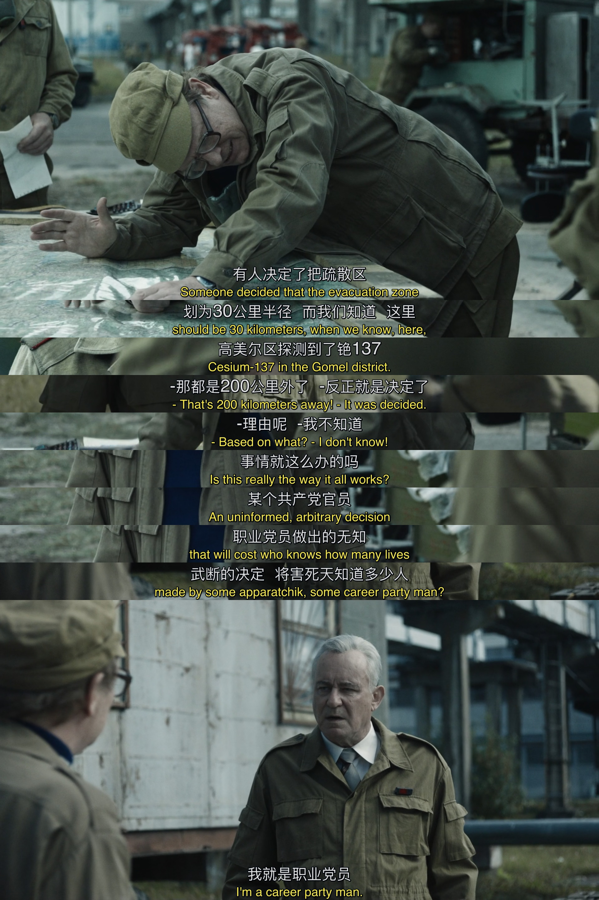

谁是最可爱的人？知道自己面临的巨大风险，还义无反顾的人民。

这一幕和上集末尾征召三人何其相似，人民不知道why，活动就不会获得人民的支持。

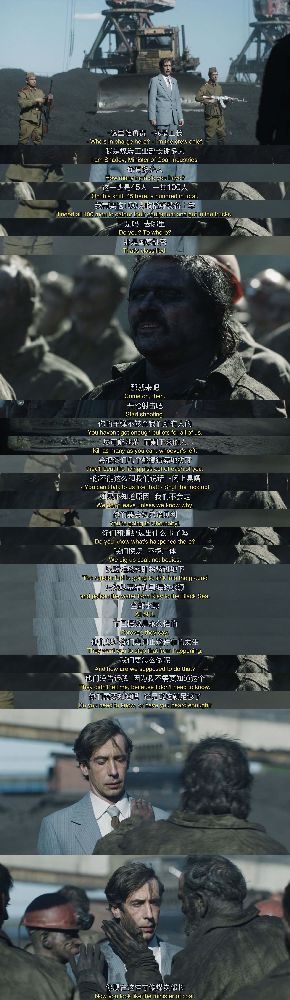

这幕的开头结尾呼应得很搞笑，再次用一部分真话（稀释过的真相——一定程度上管用）告知群众，仿佛群众什么都不懂似的。群众不需要懂那么多科学，懂人性也是很有效的方法。

这段还描绘了一个事实——工长在听完工作介绍和工期要求后一秒钟后就提出了具体的人数需求，问清楚情况后一刻不耽误立刻开工。

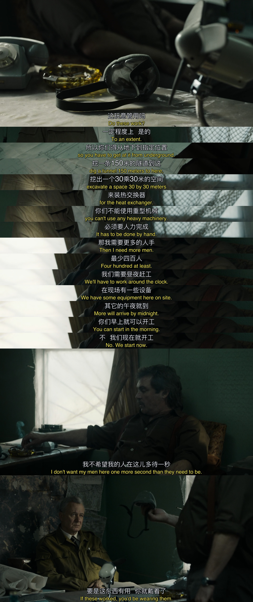

只是比上集的3人离辐射远了十几米，就连名字都留不下了。

“我的肺已经吸了20年尘土了。”

这群人始终是被严重忽视的群体。当全世界抢口罩的时候，很多工作日常需要口罩的工种是否还有口罩供应都不清楚，也没多少目光投向这个群体。

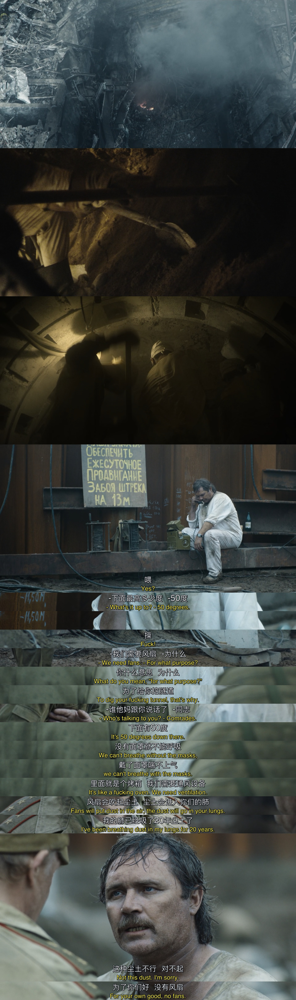

“所有人都会知道”这句话引出了一直在幕后的KGB。对同事的遭遇，列加索夫能做的只有求助（后面倒是man了一次），谢比纳一时也想不到什么办法。

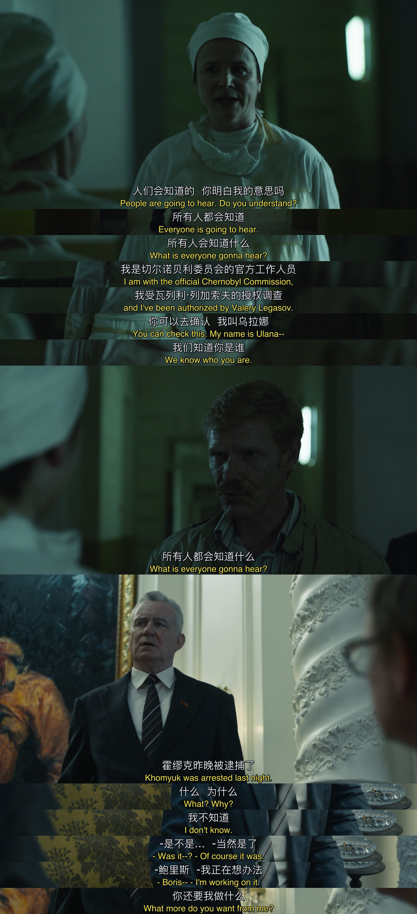

汇报了好消息之后，“unfortunate release of information”是认定为错误（疏忽）的。

询问是否达到了KGB的标准，是谢比纳想到的救霍缪克的方法。

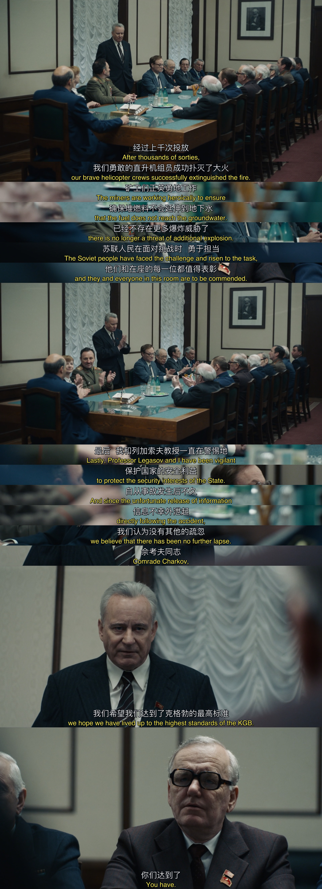

救灾行动需要几十万人参与，几千到几万的死亡，拥有如此动员能力和组织能力的国家，世所罕见。

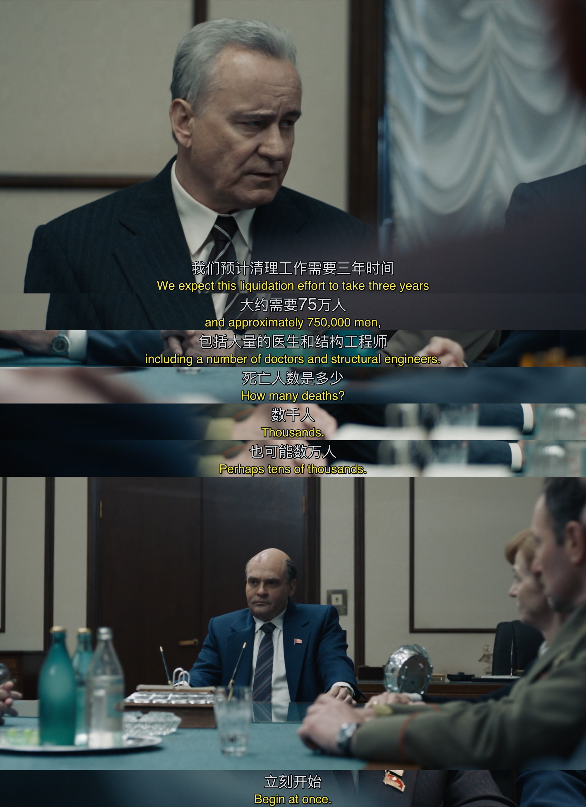

列加索夫的救援行动开始了，叫住一位能在谢比纳之前进入会场的同志开始1on1，真的需要勇气的。

印象深刻的是这句 "The KGB is a circle of accountability."

今后可以列为原则的是“Trust but verify.”

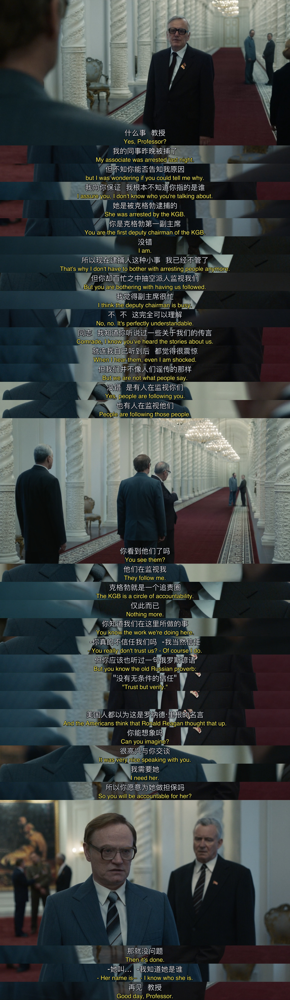

连谢比纳都被列加索夫的刚才的勇气和获得的答复感到惊喜和意外。甚至不吝告诉他一条游戏规则。

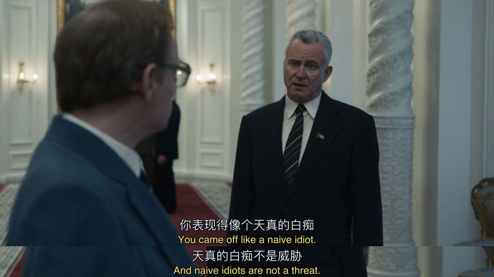

在突发公共事件中，科学家哪种傻得可爱的良心与敬业。

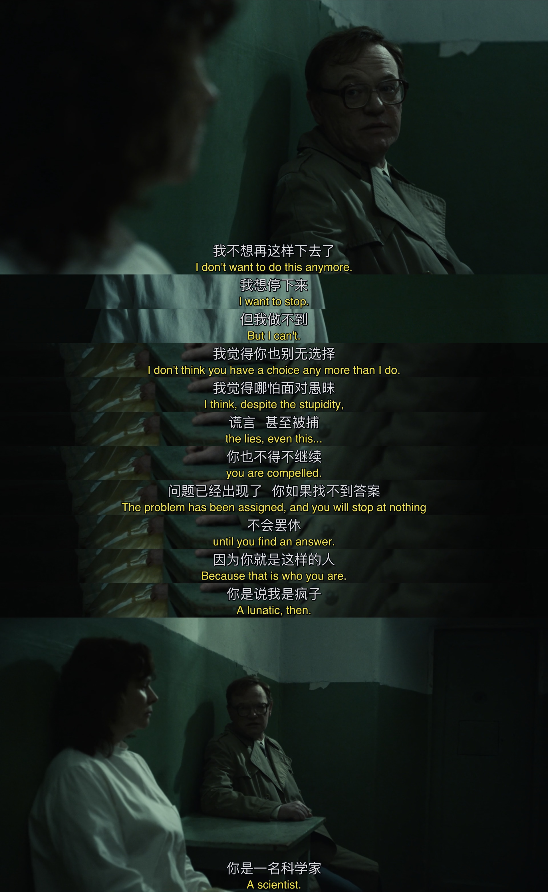

这段好像经过美化了，现实中，很多人是无缘见到亲人的石棺下葬的。

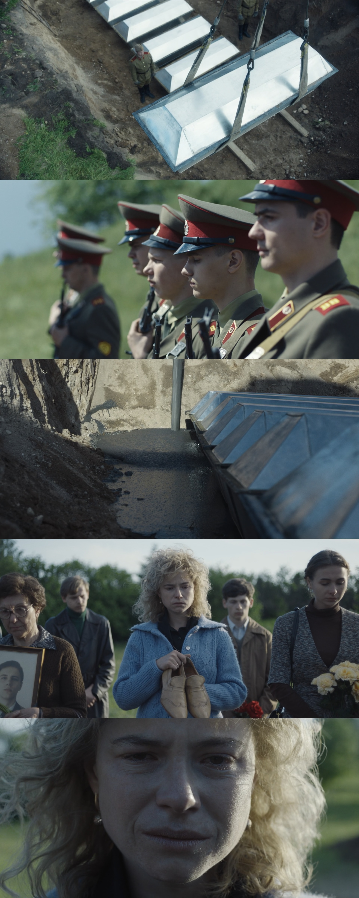

人民付出了惨痛的代价，其中一些人直接在事故和救援中牺牲，而会议室里“在座的每一位”就直接和他们一起“都值得表彰”了。不然呢？只要会议室里有人不支持，就可能增加很多人牺牲。他们的表态支持和后续的授意，值得表彰吗？

---

这部剧我是去年秋天看的，这奉旨蜗居期间，刚好重温一下。以史为鉴。
