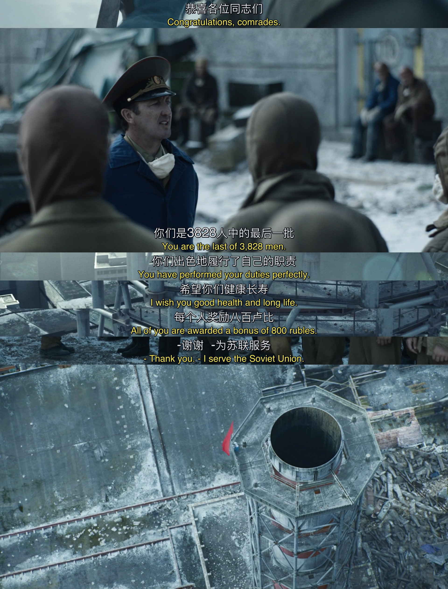

# Chernobyl S01回顾 E04

前文写了[E01, E02](https://edwardtoday.github.io/words/Chernobyl%20S01%E5%9B%9E%E9%A1%BEE01-E02)[^1]和[E03](https://edwardtoday.github.io/words/Chernobyl%20S01%E5%9B%9E%E9%A1%BEE03)[^2]。

[^1]: Chernobyl S01 回顾 E01-E02, https://edwardtoday.github.io/words/Chernobyl%20S01%E5%9B%9E%E9%A1%BEE01-E02

[^2]: Chernobyl S01 回顾 E03, https://edwardtoday.github.io/words/Chernobyl%20S01%E5%9B%9E%E9%A1%BEE03

## E04

**剧情简介**

> 4 号反应堆屋顶上的辐射量严重，为清理残留的石墨碎块，列加索夫和谢尔比纳决定调用[月球车](https://zh.wikipedia.org/wiki/月球車)。反应堆残骸内层辐射过于严重，苏联政府不得不向[西德](https://zh.wikipedia.org/wiki/西德)政府借用一台抗辐射警用机械车。然而这台名为 Joker 的机械车仅仅在调试阶段就因辐射过强烧坏电路下线，谢尔比纳随后意识到苏联政府并未告知西德方面事故现场实际辐射量。远在莫斯科的霍缪克试图查清事故成因，她申请查阅的档案却被抹去大部分内容，而她所采访的佳特洛夫则认为她永远不可能查清事故真相。
>
> 停车场工人帕沃到切尔诺贝利报到参与善后工作，他加入的团队负责射杀辐射区内所有动物，并将它们的尸体用水泥集中填埋。从未摸过枪的他慢慢适应了这项残酷的任务，然而最后面对一窝躲在房中的幼狗时，却依然无法扣下扳机。

造假其实并不容易，因为要在一个现实之外描述一个虚构的世界。事件、人物之间错综复杂的相关性，使得让一个群体共同撒一个圆满的谎几乎不可能不露破绽。

第一次看这段的时候楞了。平时接触到的环境，不管是生活还是工作，问对问题有大概率得到真相。

一个对自己命运看空的人，很难想象有什么动力驱使他继续为了他人的命运做出努力和牺牲。

抗辐射的德国车给了人们希望，却在开始调试仅仅一米后止步。面对射线，平日里我们认为比人类环境适应性强很多的机器人，变得不堪一击。在特种环境下的电子设备，跟我们民用的设备，几乎是两个世界。

谢比纳知道真相后气得摔了电话，连顶头上司都骂了。那又如何呢？人在前线，不管后方补给如何，自己的战斗还得继续。

列加索夫作为专家，还是想到了办法，只是他的胆子、权力，不足以让他执行这个方案，还得谢比纳来操作。

Biorobots开始执行任务了。缺少防护，缺少工具，只有一腔热血、平日锻炼的体魄和坚定的信念。

从最初的直升机飞蛾扑火，军队执行灭火任务，到3个工程师下水开闸，再到军人人工清理石墨块。每个人都是献祭了自己的生机，来兑换国家和民族的生机。

这时候脑子里飘过的是那句：“只要思想不滑坡，办法总比困难多。”

这时候现场指挥小组在做什么呢？分析事故真相，以准备信息披露。

迪亚特洛夫不愿意透露的内容，列加索夫最终还是说了出来。真相大白。

有司掌握了真相，并不代表大众也可以掌握。毕竟霍缪克上一集仅仅表达了想说真话的意向就被关押。

对于信息披露的程度，不同背景的人，再次出现巨大分歧。身为高官，谢比纳知道列加索夫一个科学家说真话的后果。尤其是前文已经铺垫了不少——"A global nuclear catastrophe is not possible in the SU."以及"There could be no doubt about the supremacy of the SU nuclear industry."

面对压力，面对恐惧，才是对一个人价值观真正考验的开始。

这位失去了初生女儿的母亲。我不知道她心理会如何想。一边是事故当晚救火的丈夫，健康状况日渐恶化，想陪伴最后一程；另一边是腹中的婴儿，医护人员和霍缪克反复询问是否怀孕遭她否认，最终造成今日的悲剧。

在好和坏中做选择一点都不难。难的是在两个难以接受又不得不接受的现实中做选择，无论选了什么，都会在余生被遗憾折磨。

身为局外人，仅仅在屏幕前面，无法将自己带入到剧中人物的视角去尝试问自己的选择。就好像问网民摩擦时是否应主动升级成战斗，如果掌握了美国总统那个黑箱子里的按钮会怎样之类的问题。

但剧中反映的种种问题，对今时今日的大大小小的事件如何应对，都有普遍的参考价值。

---

这部剧我是去年秋天看的，这奉旨蜗居期间，刚好重温一下。以史为鉴。