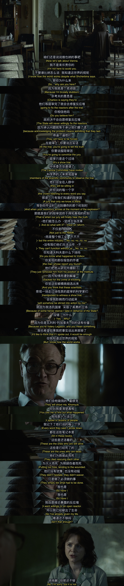
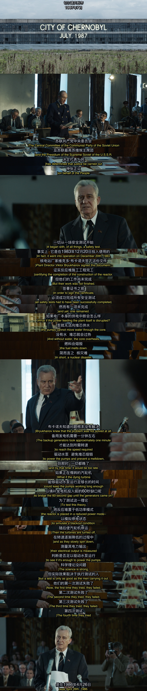
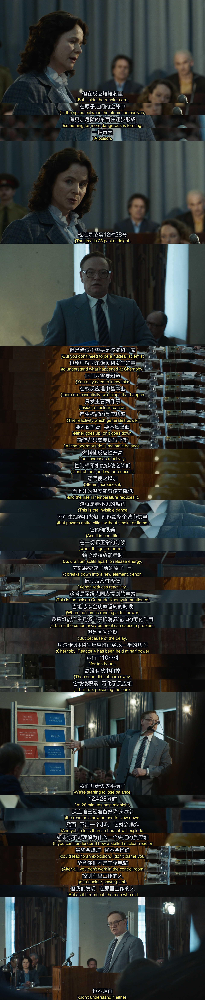
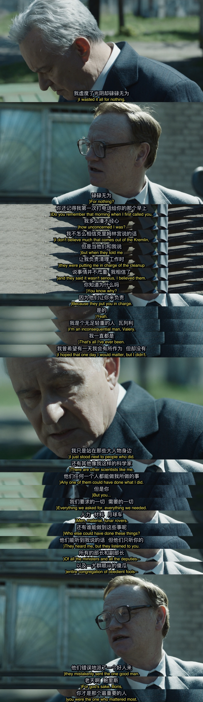
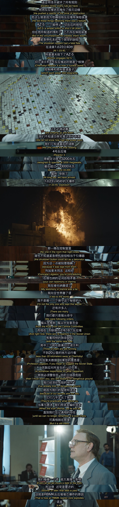
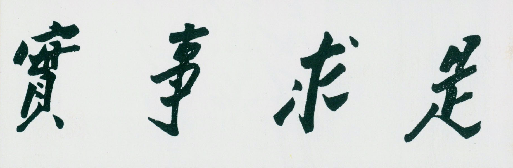

# Chernobyl S01回顾 E05

前文写了[E01, E02](https://edwardtoday.github.io/words/Chernobyl%20S01%E5%9B%9E%E9%A1%BEE01-E02)[^1], [E03](https://edwardtoday.github.io/words/Chernobyl%20S01%E5%9B%9E%E9%A1%BEE03)[^2]和[E04](https://edwardtoday.github.io/words/Chernobyl%20S01%E5%9B%9E%E9%A1%BEE04)[^3]。

[^1]: Chernobyl S01 回顾 E01-E02, https://edwardtoday.github.io/words/Chernobyl%20S01%E5%9B%9E%E9%A1%BEE01-E02

[^2]: Chernobyl S01 回顾 E03, https://edwardtoday.github.io/words/Chernobyl%20S01%E5%9B%9E%E9%A1%BEE03

[^3]: Chernobyl S01 回顾 E04, https://edwardtoday.github.io/words/Chernobyl%20S01%E5%9B%9E%E9%A1%BEE04

## E05

**剧情简介**

> 列加索夫、谢尔比纳和霍缪克三人不顾安危和声誉，试图在佳特洛夫庭审现场向受邀到场的核物理学家、核工程专家揭露事故真相 —— 除了厂长布留哈诺夫和副总工程师佳特洛夫几位的重大人为过失，切尔诺贝利核电站自身设计也存在着极其微小却致命的安全隐患 —— 与此同时，苏联全境共有 16 座存在相同安全隐患的 RBMK 反应堆仍在悄无声息地继续运转。

最后一集。

真相如何，科学家心里清楚，但是民众不清楚，世界不清楚。在最后公诉事故三个主要负责领导的法庭上，圆谎还是改口说出真相，并不是那么容易的选择。毕竟列加索夫可能也听过莫文蔚的歌——

> 从领导观点让我明白地说
>
> 无论你是挖心掏肺 呼天抢地或是热情如火
>
> 不只白白惹人讨厌让人嫌你罗唆
>
> 恨不得没跟你认识过
>
> 你讲也讲不听听又听不懂
>
> 懂也不会做你做又做不好
>
> 哼！你现在讲个这样的真相你到底是想对世界说什么？

作为一个研究所的一把手，他心理清楚得很，就算他在法庭上说出他所掌握的情况，也有极大概率一些人可以让这些供词出不了法庭就被截留。同行的支持，KGB的压力，他该怎么办？他能怎么办？他会怎么办？

庭上，谢比纳的证词很正统，很讲原则，既不放过一个坏人，也不牵扯更多，说的都是实话，但就是不说出全部。

霍缪克的证词，基于她无数的一手访谈，细节详实，同样指出了管理问题，责任在三位被告，尤其是迪亚特洛夫。

至于另一个科学问题和体制问题，必须有一位地位更高的人来点火引爆，或者，掩盖。除了列加索夫，谁也不知道他是什么时候做出的决定。剧中他上场的神态和形态，看上去还没有做出最终的决定。

导演可能怕技术问题讲多了观众会累，也可能怕一口气讲完了就没机会插播其他分镜来充实旁观者评价了，也可能当年的审批确实就在此处休庭，总之在这个关键时刻，列加索夫又得到一点喘息的机会，再次问自己是不是要说，怎么说的机会。

这位科学家甚至还趁此机会安慰了这次灾难处理的顶头上司谢比纳。

难以想象，一个（相当于）副总理的高官，谢比纳对自己的评价是碌碌无为、无足轻重。

而列加索夫陈述了谢比纳不可替代的作用之后，用"mistakenly sent the one good man"表示了他揣测的上意，是派人控制政治影响，而非对群众的伤害。结果派来的人居然付出了极大努力，听从科学家的建议去救灾，显然是“派错人”了。

或许是谢比纳刚才透露说医生诊断其寿命还剩一年，列加索夫觉得自己也半斤八两；或许是想到包括自己在内的几十万人付出巨大的牺牲不应在其他反应堆上重演；也可能就简单的出于科学家的固执，总之他说了——谎言是爆炸的真正原因，这个“谎言”翻译成中文，应该是“没有做到实事求是”。

事故造成的影响之长久，苏联人民未知付出的代价之大，在看剧和看书之前是没有概念的。

谢比纳最终不是一年后，而是四年后去世。Wikipedia上有这么一段

> Shcherbina died in Moscow in 1990, aged 70. General Nikolai Tarakanov, who worked with Shcherbina during the clean-up operation, stated that he knew Shcherbina "very well" and that he "exposed himself to large doses of radiation" at Chernobyl. **It is unclear if his death was related to radiation as a 1988 decree prevented Soviet doctors from citing radiation as a cause of death or illness.**

最近（2020春）也有不少死于病毒性肺炎的，或是连病毒性肺炎的诊断都拿不到，就默默去世了。

<video controls><source src="assets/Chernobyl.memories.1080p.m4v" type="video/mp4"></video>

<video controls><source src="https://media.githubusercontent.com/media/edwardtoday/words/master/assets/Chernobyl.memories.1080p.m4v" type="video/mp4"></video>

面对问题，当实事求是。

---

这部剧我是去年秋天看的，这奉旨蜗居期间，刚好重温一下。以史为鉴。